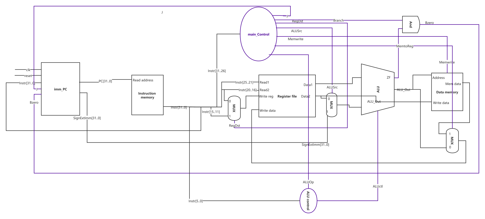
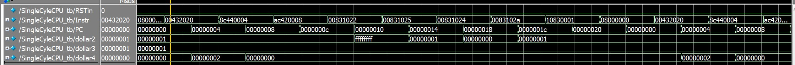
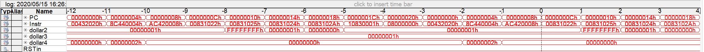

# MIPS SingleCycle CPU 
> 作者：佴瑞乾
>
> 班级：自84
>
> 学号：2018011716
>
## 支持的指令集
- 存储器读写指令：lw, sw
- 算数逻辑运算指令：add, sub, and, or, slt
- 程序控制指令：beq, j

## 数据通路

## 仿真效果

## FPGA运行效果

## 工程文件
`SingleCycleCPU.qar`

## 报告
`实验三实验报告`